<div align="center">



[](./01_fundamentals/)
[](./04_schema_design/)
[](#)

[](#full-curriculum)
[](#full-curriculum)
[](#)

**Absolute Beginner → Production-Ready · Story-Based · Real Queries · PostgreSQL-First**

</div>

---

## What Is This?

A complete SQL mastery journey — from your very first `SELECT` through joins, aggregation, schema design, query optimisation, and real-world production patterns.

Every topic is taught with:
- **Story-based analogies** so concepts click before you see a single line of SQL
- **ASCII diagrams** showing exactly how data flows through each query
- **Realistic examples** using actual tables: users, orders, products, employees
- **PostgreSQL-first** with MySQL/SQLite callouts where syntax differs
- **Interview Q&A** to pass any data or backend engineering interview

> You don't need prior database experience. Just a curious mind and optionally a running PostgreSQL instance.

---

## 🗺️ Learning Path

```
01 Fundamentals  ──►  02 Querying Basics  ──►  03 Aggregation  ──►  04 Schema Design
                                                                            │
99 Interview     ◄──  09 Real World  ◄──  08 Performance  ◄──  05/06/07 Joins + Advanced
```

**Why this order?** Master one table before joining two. Understand structure before optimising it.

---

## Skill Level Guide

<details open>
<summary><strong>🟢 Beginner — Your First SQL Queries (Start Here)</strong></summary>

> Goal: Read data from a database, filter it, sort it, and understand how tables are structured.

| Step | File | What You'll Learn |
|------|------|-------------------|
| 1 | [What is SQL](./01_fundamentals/what_is_sql.md) | What SQL is, why it exists, where it's used — the big picture |
| 2 | [Databases & RDBMS](./01_fundamentals/databases_and_rdbms.md) | Tables, rows, columns, primary keys, popular databases |
| 3 | [SQL vs NoSQL](./01_fundamentals/sql_vs_nosql.md) | When to use PostgreSQL vs MongoDB vs Redis |
| 4 | [SELECT and FROM](./02_querying_basics/select_and_from.md) | Your first query — read data from a table |
| 5 | [WHERE and Filtering](./02_querying_basics/where_and_filtering.md) | Filter rows: =, !=, BETWEEN, IN, LIKE, IS NULL |
| 6 | [ORDER BY and LIMIT](./02_querying_basics/order_by_and_limit.md) | Sort results, get the top N rows, pagination |
| 7 | [DISTINCT and Aliases](./02_querying_basics/distinct_and_aliases.md) | Remove duplicates, name your columns cleanly |
| 8 | [Aggregate Functions](./03_aggregation/aggregate_functions.md) | COUNT, SUM, AVG, MIN, MAX — summarise your data |
| 9 | [GROUP BY and HAVING](./03_aggregation/group_by_and_having.md) | Group rows, filter groups — the HAVING vs WHERE distinction |

**Goal:** Write a query that shows total revenue per product category, filtered to categories over £10,000.

</details>

<details>
<summary><strong>🔵 Intermediate — Joins, Schema Design & Advanced Queries</strong></summary>

> Goal: Connect multiple tables, design schemas correctly, and write complex analytical queries.

| Step | File | What You'll Learn |
|------|------|-------------------|
| 1 | [Tables & Constraints](./04_schema_design/tables_and_constraints.md) | CREATE TABLE, PRIMARY KEY, FOREIGN KEY, CASCADE |
| 2 | [Data Types](./04_schema_design/data_types.md) | INT, VARCHAR, DECIMAL, TIMESTAMP, JSONB, UUID |
| 3 | [Normalization](./04_schema_design/normalization.md) | 1NF → 2NF → 3NF — one source of truth |
| 4 | [Indexes](./04_schema_design/indexes.md) | What indexes are, when to create them, composite indexes |
| 5 | [INNER JOIN](./05_joins/inner_join.md) | Match rows from two tables — only where both exist |
| 6 | [LEFT / RIGHT / OUTER JOIN](./05_joins/left_right_outer_join.md) | Keep unmatched rows, find missing data |
| 7 | [CROSS and SELF JOIN](./05_joins/cross_and_self_join.md) | Cartesian product, org hierarchies, row comparisons |
| 8 | [JOIN Patterns](./05_joins/join_patterns.md) | 6 real-world join recipes every engineer must know |
| 9 | [Window Functions](./03_aggregation/window_functions.md) | ROW_NUMBER, RANK, LAG, LEAD, running totals |
| 10 | [Subqueries](./06_advanced_queries/subqueries.md) | Queries inside queries, EXISTS vs IN |
| 11 | [CTEs](./06_advanced_queries/ctes.md) | WITH clause, chained CTEs, recursive CTEs |
| 12 | [CASE and Conditionals](./06_advanced_queries/case_and_conditionals.md) | If-else logic inside SELECT, COALESCE, NULLIF |
| 13 | [String & Date Functions](./06_advanced_queries/string_and_date_functions.md) | TRIM, SUBSTRING, DATE_TRUNC, EXTRACT, INTERVAL |

**Goal:** Write a query that ranks customers by monthly spend using a window function over a CTE.

</details>

<details>
<summary><strong>🔴 Advanced — Data Modification, Performance & Production Patterns</strong></summary>

> Goal: Write data safely, optimise slow queries, and apply SQL in real production systems.

| Step | File | What You'll Learn |
|------|------|-------------------|
| 1 | [INSERT](./07_data_modification/insert.md) | Bulk inserts, INSERT INTO SELECT, ON CONFLICT upsert |
| 2 | [UPDATE and DELETE](./07_data_modification/update_and_delete.md) | Safe updates, TRUNCATE vs DELETE, soft delete |
| 3 | [Transactions](./07_data_modification/transactions.md) | ACID, BEGIN/COMMIT/ROLLBACK, isolation levels |
| 4 | [Query Optimization](./08_performance/query_optimization.md) | N+1, execution order, slow query patterns to avoid |
| 5 | [Execution Plans](./08_performance/execution_plans.md) | EXPLAIN ANALYZE, Seq Scan vs Index Scan, reading costs |
| 6 | [Indexing Strategies](./08_performance/indexing_strategies.md) | Composite index order, covering indexes, when NOT to index |
| 7 | [Views](./09_real_world/views.md) | CREATE VIEW, materialized views, when to use each |
| 8 | [Stored Procedures](./09_real_world/stored_procedures.md) | PL/pgSQL functions, parameters, error handling |
| 9 | [Triggers](./09_real_world/triggers.md) | Auto-timestamps, audit logs, BEFORE/AFTER triggers |
| 10 | [SQL with Python](./09_real_world/sql_with_python.md) | psycopg2, SQLAlchemy, pandas, parameterised queries |
| 11 | [Interview Master](./99_interview_master/sql_questions.md) | 26 Q&As — beginner to advanced to scenario questions |
| 12 | [SQL Scenarios](./99_interview_master/sql_scenarios.md) | 25 real-world scenario questions — diagnosis, design, optimisation |

**Goal:** Optimise a slow JOIN query using EXPLAIN ANALYZE, add the right index, and wrap the write in a transaction.

</details>

---

## Full Curriculum

<details open>
<summary><strong>🟢 01 — Fundamentals</strong></summary>

| File | Key Concepts |
|------|-------------|
| [what_is_sql.md](./01_fundamentals/what_is_sql.md) | SQL definition · SELECT/INSERT/UPDATE/DELETE · 50-year history · where SQL runs |
| [databases_and_rdbms.md](./01_fundamentals/databases_and_rdbms.md) | Tables · rows · columns · primary key · foreign key · PostgreSQL vs MySQL vs SQLite |
| [sql_vs_nosql.md](./01_fundamentals/sql_vs_nosql.md) | ACID vs BASE · document/key-value/graph/column stores · when to pick each |

</details>

<details>
<summary><strong>🟢 02 — Querying Basics</strong></summary>

| File | Key Concepts |
|------|-------------|
| [select_and_from.md](./02_querying_basics/select_and_from.md) | SELECT * · specific columns · expressions · FROM · execution order (FROM before SELECT) |
| [where_and_filtering.md](./02_querying_basics/where_and_filtering.md) | = · != · > · < · BETWEEN · IN · LIKE · IS NULL · AND/OR/NOT · NULL gotchas |
| [order_by_and_limit.md](./02_querying_basics/order_by_and_limit.md) | ASC · DESC · multi-column sort · LIMIT · OFFSET · NULLS FIRST/LAST · pagination |
| [distinct_and_aliases.md](./02_querying_basics/distinct_and_aliases.md) | SELECT DISTINCT · column AS alias · table aliases · COUNT(DISTINCT col) |

</details>

<details>
<summary><strong>🟢 03 — Aggregation</strong></summary>

| File | Key Concepts |
|------|-------------|
| [aggregate_functions.md](./03_aggregation/aggregate_functions.md) | COUNT(*) vs COUNT(col) · SUM · AVG · MIN · MAX · NULL behaviour · COALESCE |
| [group_by_and_having.md](./03_aggregation/group_by_and_having.md) | GROUP BY · HAVING · HAVING vs WHERE · query execution order · multi-column grouping |
| [window_functions.md](./03_aggregation/window_functions.md) | OVER() · PARTITION BY · ORDER BY in window · ROW_NUMBER · RANK · DENSE_RANK · LAG · LEAD · running totals |

</details>

<details>
<summary><strong>🔵 04 — Schema Design</strong></summary>

| File | Key Concepts |
|------|-------------|
| [tables_and_constraints.md](./04_schema_design/tables_and_constraints.md) | CREATE TABLE · ALTER TABLE · DROP TABLE · PRIMARY KEY · FOREIGN KEY · UNIQUE · NOT NULL · CHECK · DEFAULT · CASCADE |
| [data_types.md](./04_schema_design/data_types.md) | INT · BIGINT · DECIMAL · FLOAT · VARCHAR · TEXT · DATE · TIMESTAMP · TIMESTAMPTZ · BOOLEAN · JSONB · UUID |
| [normalization.md](./04_schema_design/normalization.md) | 1NF · 2NF · 3NF · denormalization · one source of truth · when to break the rules |
| [indexes.md](./04_schema_design/indexes.md) | B-tree · CREATE INDEX · UNIQUE INDEX · composite indexes · partial indexes · EXPLAIN before/after |

</details>

<details>
<summary><strong>🔵 05 — Joins</strong></summary>

| File | Key Concepts |
|------|-------------|
| [inner_join.md](./05_joins/inner_join.md) | INNER JOIN · ON clause · only matching rows · multi-table joins · what gets excluded |
| [left_right_outer_join.md](./05_joins/left_right_outer_join.md) | LEFT JOIN · RIGHT JOIN · FULL OUTER JOIN · NULL-filled rows · anti-join pattern |
| [cross_and_self_join.md](./05_joins/cross_and_self_join.md) | CROSS JOIN · cartesian product · SELF JOIN · alias technique · org hierarchies |
| [join_patterns.md](./05_joins/join_patterns.md) | Anti-join · many-to-many · non-equality join · multi-table chain · hierarchy · aggregation with joins |

</details>

<details>
<summary><strong>🔵 06 — Advanced Queries</strong></summary>

| File | Key Concepts |
|------|-------------|
| [subqueries.md](./06_advanced_queries/subqueries.md) | Scalar subquery · derived table · correlated subquery · EXISTS · IN · NOT IN NULL trap |
| [ctes.md](./06_advanced_queries/ctes.md) | WITH clause · chained CTEs · CTE vs subquery · recursive CTE · cohort analysis |
| [case_and_conditionals.md](./06_advanced_queries/case_and_conditionals.md) | CASE WHEN THEN ELSE · searched vs simple · conditional aggregation · COALESCE · NULLIF |
| [string_and_date_functions.md](./06_advanced_queries/string_and_date_functions.md) | LENGTH · UPPER/LOWER · TRIM · SUBSTRING · REPLACE · CONCAT · LIKE · NOW() · DATE_TRUNC · EXTRACT · AGE · INTERVAL |

</details>

<details>
<summary><strong>🔴 07 — Data Modification</strong></summary>

| File | Key Concepts |
|------|-------------|
| [insert.md](./07_data_modification/insert.md) | INSERT VALUES · bulk insert · INSERT INTO SELECT · ON CONFLICT upsert · RETURNING |
| [update_and_delete.md](./07_data_modification/update_and_delete.md) | UPDATE with WHERE · UPDATE FROM · DELETE · TRUNCATE vs DELETE · soft delete pattern |
| [transactions.md](./07_data_modification/transactions.md) | BEGIN · COMMIT · ROLLBACK · SAVEPOINT · ACID · isolation levels · dirty reads · phantom reads |

</details>

<details>
<summary><strong>🔴 08 — Performance</strong></summary>

| File | Key Concepts |
|------|-------------|
| [query_optimization.md](./08_performance/query_optimization.md) | N+1 problem · SELECT * · function on indexed column · EXISTS vs IN · execution order |
| [execution_plans.md](./08_performance/execution_plans.md) | EXPLAIN · EXPLAIN ANALYZE · Seq Scan · Index Scan · Hash Join · cost · rows · red flags |
| [indexing_strategies.md](./08_performance/indexing_strategies.md) | Composite index column order · covering indexes · partial indexes · index bloat · when NOT to index |

</details>

<details>
<summary><strong>🔴 09 — Real World</strong></summary>

| File | Key Concepts |
|------|-------------|
| [views.md](./09_real_world/views.md) | CREATE VIEW · CREATE OR REPLACE · updatable views · materialized views · REFRESH CONCURRENTLY |
| [stored_procedures.md](./09_real_world/stored_procedures.md) | PL/pgSQL functions · RETURNS void · parameters · RAISE · error handling · MySQL PROCEDURE syntax |
| [triggers.md](./09_real_world/triggers.md) | BEFORE/AFTER · FOR EACH ROW · NEW/OLD · auto updated_at · audit log · DISABLE TRIGGER |
| [sql_with_python.md](./09_real_world/sql_with_python.md) | psycopg2 · sqlite3 · SQLAlchemy ORM · parameterised queries · SQL injection · pandas read_sql |

</details>

<details>
<summary><strong>🏆 99 — Interview Master</strong></summary>

| File | Key Concepts |
|------|-------------|
| [sql_questions.md](./99_interview_master/sql_questions.md) | 26 Q&As · Beginner (7) · Intermediate (7) · Advanced (8) · Scenario (4) · schema design · optimisation |
| [sql_scenarios.md](./99_interview_master/sql_scenarios.md) | 25 scenario Q&As · anti-join · window functions · recursive CTE · schema design · fraud detection · batch delete |

</details>

---

## 🔑 Quick Reference

```sql
-- The 6 query clauses — always execute in this order:
-- FROM → WHERE → GROUP BY → HAVING → SELECT → ORDER BY → LIMIT

-- Basic read
SELECT name, email FROM users WHERE active = true ORDER BY created_at DESC LIMIT 10;

-- Aggregate
SELECT category, COUNT(*) AS total, SUM(amount) AS revenue
FROM orders GROUP BY category HAVING SUM(amount) > 10000;

-- Join (find orders with customer names)
SELECT u.name, o.total, o.created_at
FROM orders o INNER JOIN users u ON o.user_id = u.id;

-- Anti-join (customers who never ordered)
SELECT u.name FROM users u
LEFT JOIN orders o ON u.id = o.user_id WHERE o.id IS NULL;

-- Window function (rank customers by spend)
SELECT name, total_spend,
  RANK() OVER (PARTITION BY region ORDER BY total_spend DESC) AS rank
FROM customer_summary;

-- CTE (readable multi-step query)
WITH monthly AS (
  SELECT DATE_TRUNC('month', created_at) AS month, SUM(total) AS revenue
  FROM orders GROUP BY 1
)
SELECT month, revenue, revenue - LAG(revenue) OVER (ORDER BY month) AS growth
FROM monthly;

-- Upsert (insert or update)
INSERT INTO products (id, name, price) VALUES (1, 'Widget', 9.99)
ON CONFLICT (id) DO UPDATE SET price = EXCLUDED.price;

-- Safe transaction
BEGIN;
  UPDATE accounts SET balance = balance - 100 WHERE id = 1;
  UPDATE accounts SET balance = balance + 100 WHERE id = 2;
COMMIT;
```

---

<div align="center">

[](./01_fundamentals/what_is_sql.md)

*SQL · PostgreSQL · Story-Based · Real Queries · Beginner to Production*

</div>
